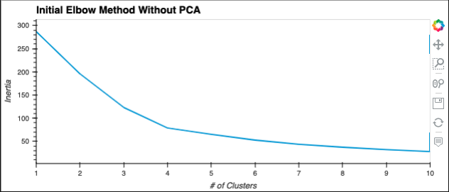
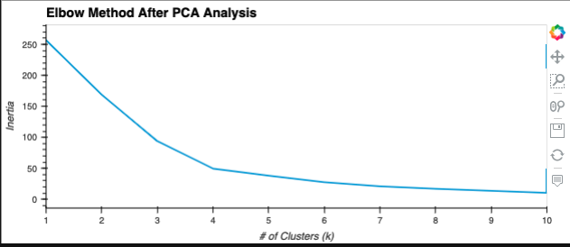
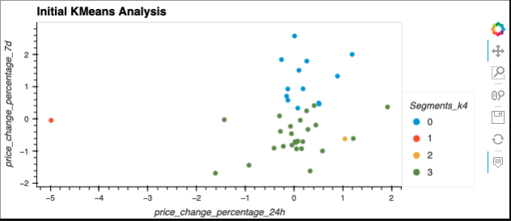
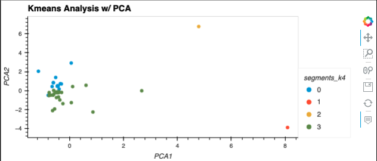

# Challenge_10

# **Crypto Currency Analysis Using KMeans Clustering & PCA**

This notebook is a performance analysis of a portfolio of crypto currencies over various timeframes.  It leverages KMeans analysis as aclustering technique to identify relationships among the various cryptocurrencies being evaluated.  The initial analysis performs the KMeans clustering without leveraging PCA and then the same analysis is performed by leveraging PCA to simplify the analysis.


---

# **Technologies**

This application is a Jupyter Notebook and makes use of the Scikit-Learn library for KMeans, PCA, and data scaling algorithms. These can be installed with the following commands: 

---

# **Installation Guide**

Before running the application you need to import the following modules:
```python
import pandas as pd
import hvplot.pandas
from path import Path
from sklearn.cluster import KMeans
from sklearn.decomposition import PCA
from sklearn.preprocessing import StandardScaler
```

---

# **Usage**
## Elbow method to determine optimal number of clusters prior to PCA analysis



## Elbow method after PCA analysis was performed:



## KMeans scatter plot prior to PCA



## KMeans scatter plot after PCA



---

# **Contributors**

Developed by:

Matthew Crater

[Linked In](https://www.linkedin.com/in/matt-crater/)

---

# **License**

MIT